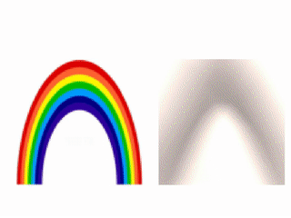
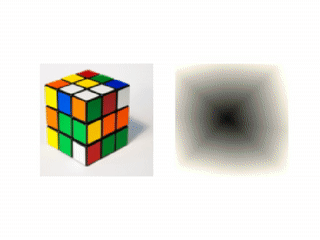

Image Painting Neural Network (Tensorflow)
==========================================

Tensorflow implementation of a neural network that paints an image.

The neural network learns the RGB output of each pixel using only the (x, y) coordinates of that pixel.


Example in action
-----------------

Here are two gifs that show what it is seen when you execute the `main.py` file.






How to run
----------

```
$ python main.py <path/input_image>
```

Automatically a new folder under `output` directory is created.
That folder contains one image for each iteration.
Stop the training when you want. After that you can create a video file from
all those images using the `make_video.sh` script.

```
$ ./make_video.sh [output/output_dir_with_your_images [FPS [output_filename [format]]]]
```

NOTE: You need to have installed `ffmpeg`.

You can create a .gif file using the script `video2gif.sh`.
This script creates very large files (320px wide, ~3MB/minute).

```
$ ./video2gif.sh <path/input_video>
```

Get information about extra parameters with:

```
$ python main.py -h
```


Attributions
------------

Some blocks of code are taken from the repository of the **[Creative Applications of Deep Learning with Tensorflow](https://github.com/pkmital/CADL) course**.

**Sample images**:

* Rainbow:
https://commons.wikimedia.org/wiki/File:Rainbow-diagram-ROYGBIV.svg

* Rubik cube:
Copyright kreatine
https://www.vecteezy.com/random-objects/10226-vector-rubik-s-cube


Contact
-------

[guiferviz@gmail.com](mailto:guiferviz@gmail.com)
[Twitter](https://twitter.com/guiferviz)
